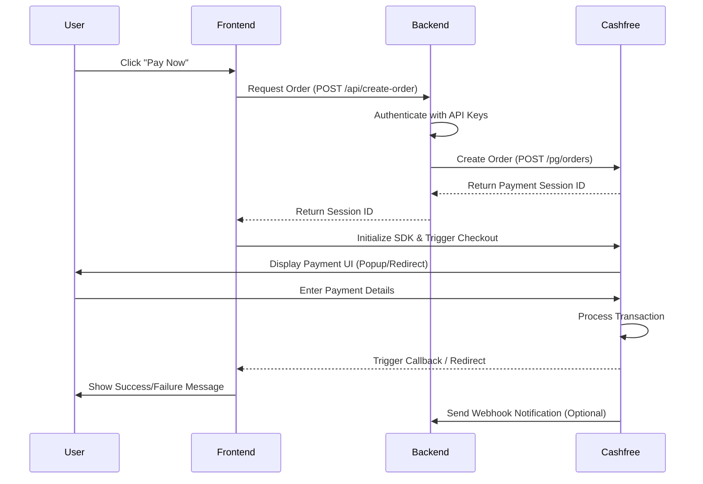

# Cashfree Payment Gateway Integration Report

This report outlines the architecture, workflow, and security best practices for integrating the Cashfree Payment Gateway (v2025-01-01) into a modern web application.

---

## 1. System Architecture & Workflow

The integration follows a **Secure Token-Based Flow**. Credentials are never exposed to the frontend; instead, the backend acts as a secure bridge between the user and Cashfree.

### 🔄 The Payment Lifecycle


---

## 2. Core Integration Steps

### Step 1: Secure Environment Setup
Store sensitive credentials (`CLIENT_ID`, `CLIENT_SECRET`) in a `.env` file. **Never** hardcode these in your source code or commit them to Git.

### Step 2: Backend Order Creation
The backend must create an order in the Cashfree system before any payment can be processed. 
- **Endpoint**: `https://api.cashfree.com/pg/orders` (Production)
- **Headers**: Requires `x-client-id`, `x-client-secret`, and `x-api-version`.
- **Payload**: Includes amount, currency, and customer details.

### Step 3: Frontend SDK Initialization
Include the Cashfree JS SDK in your HTML:
```html
<script src="https://sdk.cashfree.com/js/v3/cashfree.js"></script>
```
Initialize the SDK instance:
```javascript
const cashfree = Cashfree({ mode: "production" });
```

### Step 4: Triggering Checkout
Use the `payment_session_id` received from your backend to open the payment interface:
```javascript
cashfree.checkout({
    paymentSessionId: "session_...",
    redirectTarget: "_self"
});
```

---

## 3. Security Best Practices

> [!IMPORTANT]
> **Credential Safety**: Always keep your `Client Secret` on the server. If it is ever exposed in a frontend script, revoke it immediately via the Merchant Dashboard.

| Feature | Description |
| :--- | :--- |
| **Server-Side Auth** | All API calls to Cashfree must originate from the backend to protect API keys. |
| **HTTPS Only** | Cashfree production environment requires `return_url` and `notify_url` to be HTTPS to prevent MITM attacks. |
| **Payload Validation** | Validate the amount and order details on the backend before sending them to Cashfree. |
| **Idempotency** | Use unique `order_id`s (e.g., `order_${timestamp}`) to prevent duplicate payments for the same intent. |
| **Checksum/Signature** | For older versions, checksums were used. In v3+, the `payment_session_id` acts as a secure, short-lived token for the transaction. |

---

## 4. Advanced Features

### 🔔 Webhooks (Notify URL)
Webhooks are asynchronous notifications sent from Cashfree to your server. They are essential for:
- Updating your database when a payment is successful.
- Handling "User Dropped" or "Transaction Failed" states even if the user closes their browser.

### 🏦 International Payments
As seen in your recent update, Cashfree supports multiple currencies (e.g., `AED`, `USD`). 
- **Requirement**: International payments must be enabled on your Cashfree account.
- **Conversion**: Cashfree handles the currency conversion and settles in your base currency (INR).

---

## 5. Troubleshooting Common Errors

| Error Code | Potential Cause | Solution |
| :--- | :--- | :--- |
| `order_meta.return_url_invalid` | Using `http://` in production. | Ensure the URL starts with `https://`. |
| `authentication_failed` | Wrong Client ID/Secret or wrong Mode. | Check `.env` and verify if using Sandbox vs. Production keys. |
| `paymentSessionId is missing` | Backend failed to return the session ID. | Check backend logs for API failure details. |

---

## 6. Implementation Checklist
- [ ] API Keys added to `.env`
- [ ] `.env` added to `.gitignore`
- [ ] Backend endpoint `/api/create-order` implemented
- [ ] Frontend SDK script included
- [ ] `cashfree.checkout` implemented with callback/redirect logic
- [ ] (Production) All return/notify URLs are `HTTPS`

---

> [!TIP]
> Always test with a small amount (e.g., ₹1 or 1 AED) in production before going live to verify the full settlement cycle.
